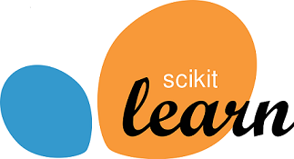

# Machine Learning Projects
Here, I am describing the Machine Learning (ML) projects that I have done. The projects have been performed inspired by the courses that I took or my personal intersts. 

:large_blue_diamond: [Predicting Diamond Price (Linear Regression)](https://github.com/HamedHeli/MLProjects/blob/0ce53fae568dc294c96499e4c3b85a37941e1438/Linear%20Regression/Diamond.ipynb): 
      
   In this project, I make a linear model for predicting the diamond's price based on its carate, clarity, color, and cut. Including the data with more than 50,000 rows, I trained the model by using 0.5% of the population (training population) and then test the model using the rest to verify the model's accuracy. The model shows >80% accurracy (in terms of R-squared). 

